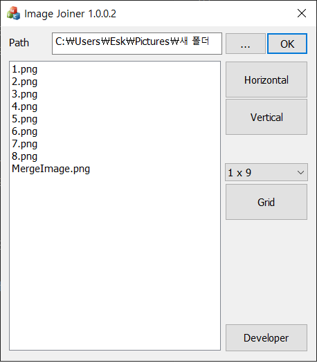

# Image Joiner
[](http://www.apache.org/licenses/LICENSE-2.0)


## Features
```
 1) Combine all images in a folder into one image.
 2) C++ (MFC)
```
## What's New? (Last updated 2021.03.29)
```
 1) Add Image Merge (Grid)
 2) Release
```
## Lasted Update List
[View Lists](./UPDATE.md)

## Development environment
```
 Operating System : Windows 10 Pro 64bit
 CPU : AMD Ryzen R5 3600
 RAM : 32GB
 VGA : AMD Radeon RX 5700 XT
 IDE : Visual Studio 2019 Community 16.7.6
```

## License
Copyright 2021 Jeon Ye-Chan(Eskeptor)

Licensed under the Apache License, Version 2.0 (the "License");
you may not use this file except in compliance with the License.
You may obtain a copy of the License at
```
http://www.apache.org/licenses/LICENSE-2.0
```
Unless required by applicable law or agreed to in writing, software
distributed under the License is distributed on an "AS IS" BASIS,
WITHOUT WARRANTIES OR CONDITIONS OF ANY KIND, either express or implied.
See the License for the specific language governing permissions and
limitations under the License.
## Good Bye!!
Compiled by Visual Studio 2019 Community 16.7.6
